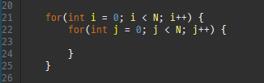
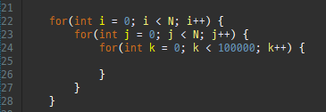
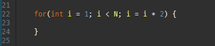
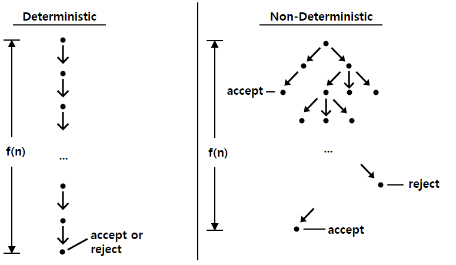
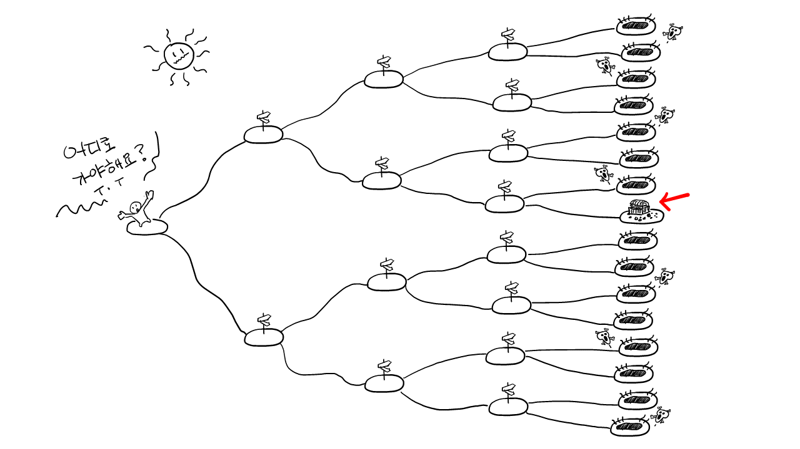
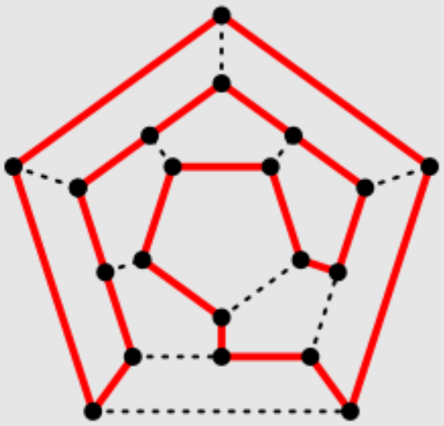

# 시간복잡도와 P-NP 문제

작성자 : 김대희

작성일 : 2022-05-07

---

## 알고리즘이란?

- “어떠한 문제를 해결하기 위해 정해진 일련의 절차나 방법”
    - 요리 레시피에 비유할 수 있다.
    - 심부름에 비유할 수 있다.
    - 컴퓨터 공학에서 알고리즘은 어떤 문제를 해결하는 방법을 컴퓨터가 이해할 수 있는 단계로 풀어서 기술한 것이라고 말할 수 있다.
- 효율적인 알고리즘이란 유한한 공간(메모리)과 시간을 효율적으로 사용하기 위함

## 시간 복잡도(Time Complexity)

알고리즘의 평가 수단으로 알고리즘이 입력 크기에 따라서 단위(or 기본) 연산이 몇 번 수행되는 지 분석하는 척도.

- 기본 연산 :
    1. 데이터 입, 출력 : copy, move, print 등
    2. 산술 연산 : 사칙연산 등
    3. 논리 연산 : ==, != , >, < 등
- 실제 컴퓨터의 실행 속도는 아님
- 표기법
    
    
    | 최악의 경우 | ⁍ : 빅 오 표기법 | 최악의 시나리오로 아무리 오래 걸려도 이 시간보다 덜 걸림 |
    | --- | --- | --- |
    | 최선의 경우 | ⁍ : 빅 오메가 표기법 | 최선의 시나리오에 이만한 시간이 걸림 |
    | 평균적인 경우 | ⁍ : 빅 세타 표기법 | 평균 시간을 나타냄 |
- 시간복잡도 예시
    - $O(N^2)$
        
        
        
    - $O(N^2)$
        
        
        
    - $O(logN)$
        
        
        

### 코딩테스트에서의 시간 복잡도

- 최악의 경우가 항상 중요하다. → 시간 복잡도를 표현할 때 빅오 표기법을 사용한다.
- 대략적인 연산 횟수

|  | 명칭 | N이 1,000(10^3) = 1024 = 2^10일 때의 연산 횟수 |
| --- | --- | --- |
| ⁍ | 상수 시간 | C (상수) |
| ⁍ | 로그 시간 | 10 |
| ⁍ | 선형 시간 | 1,000 = 10^3 |
| ⁍ | 로그 선형 시간 | 10,000 |
| ⁍ | 이차 시간 | 1,000,000 = 10^6 |
| ⁍ | 삼차 시간 | 1,000,000,000 = 10^9 = 10억 |

연산 횟수가 **1억**(10^**8**)을 넘어가면 C언어 기준으로 통상 1초 이상의 시간이 소요된다.

JAVA는 시간이 더 걸리기 때문에 백준 기준으로 +2초의 시간을 더 준다고 되어있다.

# P문제와 NP문제

### 결정 문제(Deterministic Problem)란?

- 답이 YES 아니면 NO로 반환되는 문제이다. 예를 들어, ‘a는 b의 배수인가?’ 와 같은 질문도 결정 문제라고 말할 수 있다.
- P와 NP는 모두 결정 문제의 분류에 해당한다

## P 문제란?

- P 문제 또는 P 클래스 문제라고 하며, 결정 문제들 중 쉽게 풀리는 것을 모아놓은 집합이다.
- 쉽게 풀린다는 것?
    - 현실적인 시간 안에 해결할 수 있다.
    - 다항식 시간(**P**olynomial time)  이내에 문제의 답을 계산해낼 수 있는 알고리즘이 존재한다. → 다항 시간 알고리즘(Polynomial-Time Algorithm)
    - 거시적인 관점에서 다항 시간에 문제를 해결한다면 이를 효율적인 알고리즘(efficient algorithm)이라고 부를 수 있다.

## NP 문제란?

> 다항 시간이 있으면 비다항 시간(팩토리얼, 지수 등)이 있다. 
따라서 비다항 시간이라서 NP (None or Not) Polynomial 문제? (X)
> 

<aside>
💡 NP 문제에서 N은 Non-deterministic 즉 “비-결정적”, “비-결정론적” 이다.

</aside>

- NP 문제란 비결정적 알고리즘(non-deterministic algorithm)으로 다항시간 내에 문제를 해결할 수 있는 문제라고 정의한다.

비결정적 알고리즘이란?

동일한 입력이 주어지더라도 매번 다른 과정을 거쳐 다른 결과를 도출하는 알고리즘을 의미한다.

비결정적 알고리즘 만드는 방법)

- 입력 이외의 외부 상태를 알고리즘에 적용함 (난수, 타이머 값, 전역변수 등)
- 여러 개의 프로세서가 동시에 같은 메모리에 값을 쓰려고 하는 경우, 각 프로세서가 어떤 순서로 썼는지에 따라 결과가 달라진다.

결정적 알고리즘이란?

동일한 입력이 주어지면 언제나 똑같은 과정을 거쳐 언제나 같은 결과를 내는 알고리즘을 의미한다.

결정적 알고리즘 예시 (무언가를 선택해야 하는 상황)

- 최소 스패닝 트리에서 그래프의 각 간선을 넣을지 말지 결정해야 한다.
- 배낭 문제에서 배낭에 물건을 담을지 말지 결정해야 한다.
- 외판원 문제에서 각 도시를 몇 번째 순서에 방문할지 결정해야 한다.

### 비결정적 알고리즘 예시

문제) 모험가는 왼쪽에서 출발해서, 가장 오른쪽 지점중에 보물이 있는지 없는지 판단해야한다.(결정문제)

모험가가 간선 한 개를 지나는데 1분이라 하면)

- 결정적 알고리즘(모든 길을 한명이 확인해야함)으로 풀면 깊이가 30일때 최악의 경우 49,000년
- 비결정적 알고리즘(분신술: 동시에 모든 갈림길로 진행 가능)으로 풀면 깊이가 30이라면 O(N)이므로 30분
- 하지만, 분신술은 현실적이지 못하다(구현할 수 없다). 하지만 어떠한 힌트가 있을 수 있다.
    - 힌트: “보물이 있다면 아마 이쪽에 있을 것이다”
- 따라서, 힌트를 따라 도달한 마지막 지점에 보물이 있다면 답을 YES로 결정할 수 있고, 보물이 없다면 답을 NO로 결정할 수 있다.
- 이러한 맥락으로, 비결정적 알고리즘을 어떠한 힌트를 검증하는 결정론적 알고리즘으로 대체할 수 있다.
    - 이러한 힌트를 `certificate`라고 부르고, 이 힌트를 검증한다는 의미로 결정론적 알고리즘을 `verifier`라고 부른다.
    

> 위 예시의 분신술처럼 양자컴퓨팅이나 비결정론적 튜링 기계를 사용한다면 NP를 비결정적 알고리즘으로 접근할 수 있다.
> 

**쉽게 말해서, 답을 알고 있을 때 적어도 검산은 다항 시간 내에 할 수 있는 문제를 NP문제라 한다**

- 모든 암호화 알고리즘들은 NP문제에 의존한다 → 힌트가 없으면 다항 시간내에 풀지 못한다.(힌트가 있다면 바로 해독)
- 소인수 분해 문제
    - p = 2,432,902,008,176,640,029
    - q = 51,090,942,171,709,440,031
    - n = 124,299,255,809,188,482,950,823,560,714,650,000,000
    - p와 q를 곱해 n이 되는 것은 다항시간내에 해결되므로 결정적 알고리즘이지만, n을 소인수 분해하는 것은 비결정적 알고리즘으로 NP문제이다.

## P vs NP

P와 NP는 각각 어떤 문제들의 부분집합이다

- P 는 그중에서도 어떤 결정적 알고리즘으로 다항 시간에 해결할 수 있는 문제들의 집합
- NP는 어떤 비결정적 알고리즘으로 다항시간에 해결할 수 있는 문제들의 집합.

> 앞에서 우리는 비결정론적 알고리즘을 `verifier`와 `certificate`으로 표현할 수 있다고 하였습니다. 따라서 NP는 다음의 조건을 만족하는`verifier`와 `certificate`이 존재하는 문제들의 집합으로도 나타낼 수 있습니다.

입력 $I$에 대해, 모든 `certificate`의 크기는 $|I|$의 어떤 다항식을 넘지 않는다.입력 $I$와 어떤 `certificate` $h$에 대해, $|I|$와 $|h|$의 다항 시간에 주어진 h를 검증하는 `verifier`가 존재한다.

출처: **[https://gazelle-and-cs.tistory.com/64](https://gazelle-and-cs.tistory.com/64)**
> 

## P-NP 문제란?

밀레니엄 문제는 2000년 5월 24일에 클레이 수학연구소가 정한, 21세기 사회에 가장 크게 공헌할 수 있지만 아직까지 풀리지 않은 미해결 수학 문제 7가지를 말한다.

- 풀어내면 100만 달러(약 12억원)와 세계적인 명예를 얻게 된다.
- 7개 난제 중 한 개는 증명되었고 나머지 6개는 미증명 이론으로 남아있다.
- P-NP문제는 밀레니엄 문제 중 하나이다.

### P-NP 문제 개념

만약 어떤 문제 P가 주어졌고, 그 문제의 답이 YES라면, 우리는 그 문제의 답에 관한 힌트가 주어지면 곧바로(다항 시간 이내에) 그 문제의 답이 YES라는 것을 검증할 수 있다. 따라서 모든 P문제는 저절로 NP문제도 된다.

따라서 $P⊂NP$ 임을 알 수 있다.

하지만 그 반대인  $NP⊂N$ 에 대해서는 참인지 거짓인지 아직 알려져 있지 않다.

만약 모든 NP문제가 P문제인 경우, 즉 모든 NP 문제가 다항시간에 풀 수 있는 알고리즘이 존재함을 증명할 경우 $P=NP$가 된다

> 당신이 증명할 경우 이 세상 모든 암호를 해킹하여 내 계좌로 모든 돈을 송금할 수도 있다.
> 

### 학계의 예측

사실 많은 학자들은 P≠NP일 것이라고 믿는다. 

이유는 간단한데, 수많은 학자들이 여러 NP 문제들에 대해서 '다항식 시간 내에 풀 수 있는 알고리즘'을 찾으려고 노력해 왔지만 전혀 성과가 없었기 때문이다. 그렇지만, P≠NP도 증명된 것이 아니므로 어떻게 될 지는 알 수 없다.

- NP 완전(NP-Complete)
    - 이 문제만 다항 시간내에 풀 수 있다면 나머지 NP문제들은 모두 이 문제를 푼 알고리즘으로 해결할 수 있게되는 문제를 NP-완전 문제라고 한다
- NP 난해(NP-Hard)
    - 이 문제만 다항 시간내에 풀 수 있다면 나머지 NP문제들은 모두 이 문제를 푼 알고리즘으로 해결할 수 있게되는 문제이지만, NP인지 확인조차 되지 않은 문제.

### + 해밀턴순환경로 알고리즘?

- 그래프 이론 에서, **해밀턴 경로** 는 모든 정점을 한 번씩 지나는 경로이다.
- 쉽게 말해 한 붓 그리기 정점 버전
- NP-완전 문제

참고, 자료사진 출처: 

[비결정론적 알고리즘 - 위키백과, 우리 모두의 백과사전](https://ko.wikipedia.org/wiki/%EB%B9%84%EA%B2%B0%EC%A0%95%EB%A1%A0%EC%A0%81_%EC%95%8C%EA%B3%A0%EB%A6%AC%EC%A6%98)

[P vs NP 쉽게 이해하기](https://gazelle-and-cs.tistory.com/64)