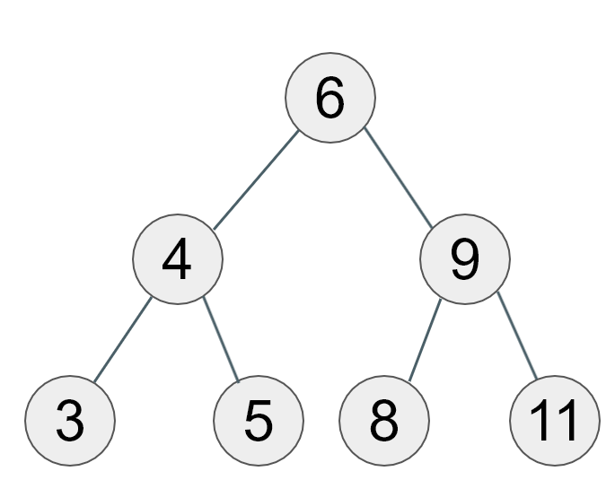

# 트라이(Trie)

## Trie란?

트라이는 문자열을 저장하고 효율적으로 탐색하기 위한 트리 형태의 자료구조이다.

자동완성 기능, 사전 검색 등 문자열을 탐색하는데 특화된 자료구조이다.

레딕스 트리(radix tree), 접두사 트리(prefix tree), 탐색 트리(retrieval tree)라고도 한다.

Trie는 re**”trie”**val tree에서 나온 단어이다.



위와 같은 정수형 자료의 이진트리에서는 검색을 수행할 때 O(logN)의 시간 복잡도를 가지게 된다. 하지만 같은 이진트리 형태여도 문자열을 저장하고 있다면 문자열의 길이가 M일 때, O(M*logN)의 시간 복잡도를 가지게 된다.


Trie는 문자열 전체를 하나의 노드에 저장하는 게 아니라, 한 단어씩 노드에 저장하는 트리이다.

Trie는 루트 노드는 비어있고 첫 번째 자식 노드부터 문자열의 각 단어가 저장된다.

현재 Trie에 저장된 문자는 cap, code, kakao, kai이다.

Trie는 문자열의 한 단어씩 자식 노드와 비교해가면서 검색을 진행할 수 있다.

cap을 검색한다면 루트노드→ 자식노드 c → 자식노드 a → 자식노드 p 순으로 검색한다.

kakao를 검색한다면 루트노드 → 자식노드 k → 자식노드 a → 자식노드 k → 자식노드 a → 자식

노드 o 순으로 검색한다.

만약 coding을 검색한다면 루트노드 → 자식노드 c → 자식노드 o → 자식노드 d → i의 값을 가지는 노드는 없으므로 검색 불가

이러한 식으로 찾고자 하는 문자를 탐색하므로 문자열의 길이가 M일 때, O(M)의 탐색 시간 복잡도를 갖는다.

## Trie 구현

기본적으로 Map을 사용해서 구현한다. 단어를 키로 갖고, 값에는 자식 노드 클래스를 저장한다.

문자가 현재 Trie에 존재하는지 체크하기 위한 boolean 변수도 추가적으로 사용해야 한다.


```java
static class Node {
	Map<Character, Node> childNode = new HashMap<>();
	boolean endOfWord; // 단어의 끝인지 체크
}
```

```java
static class Trie {
	Node rootNode = new Node();

	// Trie에 문자열 저장
	void insert(String str) {
		Node node = this.rootNode;

		// 문자열의 각 글자마다 가져와서 자식노드 중에 있는지 체크
		// 없으면 자식노드 새로 생성
		for(int i=0; i<str.length(); i++) {
			node = node.childNode.computeIfAbsent(str.charAt(i), key -> new Node());
		}

		// 저장할 문자열의 마지막 글자에 매핑되는 노드에 단어의 끝임을 기록
		node.endOfWord = true;
	}

	// Trie에서 문자열 검색
	boolean search(String str) {
		Node node = this.rootNode;

		// 문자열의 각 글자마다 노드가 존재하는지 체크
		for(int i=0; i<str.length(); i++) {
			// 문자열의 각 단어에 매핑된 노드가 존재하면 가져오고 아니라면 null
			node = node.childNode.getOrDefault(str.chatAt(i), null);
			// 노드가 null이라면 현재 Trie에 해당 문자열은 없는 것이므로 false
			if(node == null) {
				return false;
			}
		}
		// 문자열의 마지막 글자까지 매핑된 노드가 존재한다고 해서 문자열이 존재하는 것은 아님
		// busy를 Trie에 저장했으면, bus의 마지막 s에 매핑된 노드는 존재하지만 Trie에 저장된
		// 것은 아님. 그러므로 현재 노드가 단어의 끝인지 아닌지 체크하는 변수의 값을 반환
		return node.endOfWord;
	}
}
```

## Map Interface의 유용한 메서드

1. computeIfAbsent()

첫 번째 파라미터는 key이고 두 번째 파라미터에 람다식을 전달하면 된다.

```java
Map<String, String> map = new HashMap<>();

// 값이 없으면 람다식의 결과 값을 put하고 값 리턴
String value = map.computeIfAbsent("nojam", key -> "Coding" + key );
System.out.println(value); // 실행결과 : Codingnojam

// 값이 존재하면 해당 key의 값 리턴
value = map.computeIfAbsent("nojam", key -> "Hi" + key );
System.out.println(value); // 실행결과 : Codingnojam
```

```java
default V computeIfAbsent(K key,
	Function<? super K, ? extends V> mappingFunction) {
	// 1. 람다식이 null인지 체크
	Objects.requireNonNull(mappingFunction);

	V v;
	// 2. 파라미터로 받은 key의 value값이 null인지 체크
	if ((v = get(key)) == null) {
		V newValue;

		// 3. 람다식에 key 전달 후 리턴 값이 null인지 체크
		if ((newValue = mappingFunction.apply(key)) != null) {
			// 4. 해당 key의 value값으로 newValue 매핑 후 리턴
			put(key, newValue);
			return newValue;
		}
	}
	// 5. key의 value값이 null이 아니라면 해당 key의 value 리턴
	return v;
}
```

1. getOrDefault()

key에 매핑된 value값이 있다면 가져오고, 존재하지 않으면 default값을 가져온다.

```java
Map<String, String> map = new HashMap<>();
map.put("Java", "NoJam");

// Java 키에 매핑 된 값이 존재하므로 NoJam 반환
String str = map.getOrDefault("Java", "Hi");
System.out.println(str); // NoJam 출력

// Map이라는 키에 매핑 된 값이 없으므로 default값인 Interface 반환
str = map.getOrDefault("Map", "Interface");
System.out.println(str); //Interface 출력

// HashMap이라는 키에 매핑 된 값이 없으므로 default값인 Interface 반환
str = map.getOrDefault("HashMap", "Interface");
System.out.println(str); //Interface 출력
```

1. forEach()

Map이 갖고 있는 key와 value의 값을 하나씩 차례대로 꺼낼 때 사용하면 유용한 메서드이다.

```java
Map<String, String> map = new HashMap<>();
map.put("coding", "01");
map.put("Java", "NoJam");
map.put("Coding", "CodingNoJamHello");
map.put("nojam", "Codingnojam");

// 내부에서 key와 value를 쌍으로 하나씩 꺼내서 출력
map.forEach((k, v) -> System.out.println(k + " : " + v));

/*
 * coding : 01
 * Java : NoJam
 * Coding : CodingNoJamHello
 * nojam : Codingnojam
 */
```

참고 자료

Trie를 Java로 구현해보자 [https://codingnojam.tistory.com/40](https://codingnojam.tistory.com/40)

Map Interface의 유용한 메서드를 알아보자 [https://codingnojam.tistory.com/39](https://codingnojam.tistory.com/39)