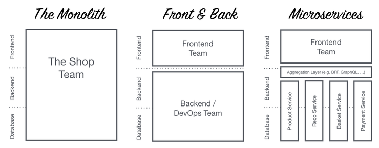

# 도메인 주도 설계 (DDD)

작성자 : 김대희

작성일 : 2022-06-04

---

<aside>
💡 10~15분 가량의 발표에 사용되는 자료로서 해당 지식을 분석, 서술하기보다 개념의 용어표현과 의미를 전달하는 것에 초점을 맞췄습니다.

</aside>

# Domain, DDD(Domain Driven Design)개념

### 도메인이란?

사전적 정의 - 1. (지식, 활동의)영역, (책임의) 범위 2.(개인, 정부 등의)소유지 3.도메인

DDD에서의 도메인이란 쉽게 말해 비즈니스 영역, 소프트웨어로 해결하고자 하는 문제 영역

### 도메인 주도 설계(DDD)란?

소프트웨어 설계 접근 방법 중 하나로, 도메인 전문가와 소프트웨어 전문가의 협업으로 이루어진다.

- 소프트웨어 복잡성을 낮추는 기술
- 소프트웨어가 복잡한 이유는? → 도메인이 복잡하기 때문이다 → 따라서 해당 도메인을 중심으로 개발
    - 예) 회계 프로그램, 금융 프로그램 등
    - 데이터 중심의 접근법을 탈피하여, 복잡한 도메인을 해결하는 것을 우선순위로 생각하고 소프트웨어를 설계하는 방법.
    - 유비쿼터스(Ubiquitous)언어(또는 보편언어)를 사용하여 도메인과 구현을 충분히 만족하는 모델을 만든다.

### 유비쿼터스 언어란?

도메인 전문가와 소프트웨어 전문가와 같이 프로젝트 구성원 모두간의 커뮤니케이션 문제를 없애고 상호가 이해할 수 있는 언어로 모든 문서와 코드에 이르기 까지 동일한 표현과 단어로 구성된 단일화된 언어체계를 구축해 나가기 위해 정의하는 언어

- 유비쿼터스 언어가 필요한 이유 (WHY?)
    1. 커뮤니케이션의 오류는 프로젝트 진행의 병목 지점이 된다.
        - 구성원간 각자의 언어를 사용한다면 의사소통에 비용이 든다. 상대방이 말할 때마다 내가 알고있는 언어로 번역해야하고 내가 설명할 때마다 첨언을 달아야한다.
        - 명세서대로 구현을 마치고 나면 도메인 전문가가 의도했던 결과가 아닐 수 있다.
    2. MSA를 도입한 조직에서 언어는 업무 범위와 책임을 정의한다.
        - Bounded Context는 유비쿼터스 언어 모델 기반으로 정의된다.
- 유비쿼터스 언어를 만드는 방법 (HOW?)
    - 용어 사전을 만든다
        - 프로젝트 구성원(도메인 전문가, 아키텍트, 개발자)이 모여 용어사전을 만든다.
        - 약어나 코드값 등 직관적으로 이해가 되지 않는 내용들을 줄이고 Full Name을 사용한다.
        - 그림 등의 형태로 관리하고 구성원이 자주 볼 수 있는 곳에 배치한다.

# DDD를 활용한 MSA

## MSA(MicroService Architecture)란?

- 작고 독립적으로 배포 가능한 각각의 기능을 수행하는 서비스로 구성된 프레임워크
- 완전히 독립적으로 배포가 가능하고, 다른 기술 스택(언어, DB 등)이 사용 가능한 단일 사업영역에 초점을 둔다.

### 모노리틱 아키텍처 VS 마이크로서비스 아키텍처(MSA)

- Monolithic Architecture
    - 모노리틱 아키텍처는 소프트웨어의 모든 구성요소가 한 프로젝트에 통합되어있는 형태이다. → 모듈별로 개발을 하고 개발이 완료되면 하나의 결과물로 패키징하여 배포함.
    - 단점
        - 부분의 장애가 전체 서비스의 장애로 확대될 수 있다.
        - 서비스의 변경이 어렵다 → 여러 컴포넌트가 하나의 서비스에 강하게 결합.
        - 한 Framework와 언어에 종속적이다. → 다른 언어의 강세 모듈(node.js [blockchain], python [Machine Learning])을 추가할 수 없다.
- MSA
    - 장점
        - 소프트웨어 복잡도 감소 → 개별 마이크로 서비스가 독립적이기 때문에
        - 유연한 확장 → 부족하거나 보완하고싶은 서비스만 별도로 수정, 확장이 가능하다.
        - 개발자의 생산성 향상 → 다른 도메인의 개발자와 소통할 일이 줄어 독립적으로 개발이 가능하다.
        - 출시 시간 단축 → 개별 마이크로 서비스에 변경사항을 적용하고 독립적으로 배포할 수 있기 때문에 고객에게 더 빨리 기능을 릴리스할 수 있다.
    - 단점
        - 유지보수가 어려울 수 있다→ 소프트웨어를 고객에게 전달하고 직접 운영한다면 고객이 관리하기 힘들 수 있다.
        - 장애추적, 모니터링이 어렵다.
        - 테스팅이 복잡할 수 있다.

### MSA에 왜 DDD를 활용해야 하는가?

- 마이크로 서비스 내부의 높은 응집도(High Cohension)와 다른 마이크로 서비스간의 느슨한 결합도(Loose Coupling)을 가질 수 있다
    - 말그대로 도메인 중심 설계를 하기 때문에 마이크로 서비스(도메인) 안에서 높은 응집력을 갖는 것은 물론이고 다른 도메인과는 느슨한 결합을 이룰 수 있다.

# …

<aside>
💡 3줄 요약:
도메인 주도 설계는 소프트웨어의 복잡성을 낮추는 설계 방식이다.
유비쿼터스 언어와 더불어 전략적, 전술적 방법을 사용한다.
DDD를 활용하여 MSA 기반으로 개발하면 궁합이 좋다.

</aside>