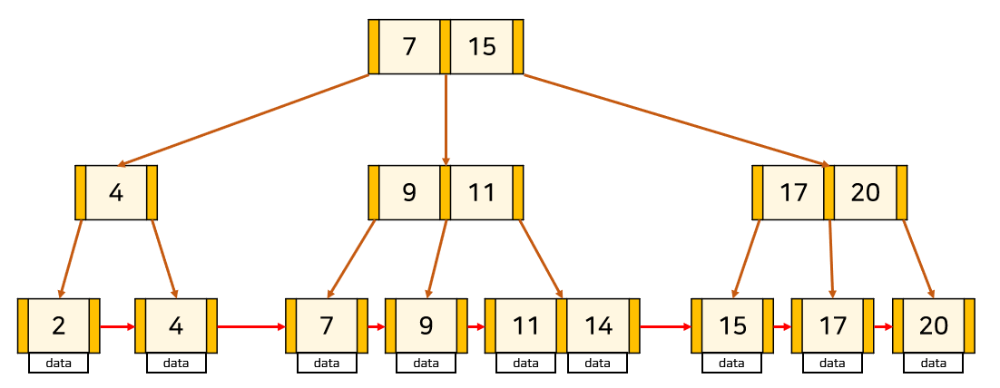

# 인덱스(Index)란?

분류: 데이터베이스
생성일: 2022년 7월 2일 오후 4:30
수정일: 2022년 7월 2일 오후 10:13

# 인덱스란 무엇인가?

- **인덱스**(:index)는 데이터베이스 분야에 있어서 추가적인 쓰기 작업과 저장공간을 활용하여 테이블에 대한 검색 속도를 높여주는 자료 구조를 일컫는다.
- 인덱스는 테이블 내의 1개의 컬럼, 혹은 여러 개의 컬럼을 이용하여 생성될 수 있다.
- 고속의 검색 동작뿐만 아니라 레코드 접근과 관련 효율적인 순서 매김 동작에 대한 기초를 제공한다.

### 간단한 비유

- 인덱스는 책의 목차에 주로 비유됨
    
    ```
    1. Intro
    2. SQL
    3. DML
    ...
    ...
    10. Transaction
    11. Concurrency Control
    ...
    ...
    50. Outro
    ```
    

## 인덱스의 자료구조

### B+Tree



[https://garonguri.tistory.com/135](https://garonguri.tistory.com/135) ← 가시면 자세한 정보가 있습니다.

- **평균 Tree의 탐색 시간복잡도 : O(logN)**
- 내가 원하는 범위만 탐색하는 것이 가능하다.

### Hash-based INDEX


- **단 하나**의 데이터를 탐색하는 시간이 O(1)으로 빠른 것이다.
- Hash Table에 저장되는 값들은 **정렬되어 있지 않기 때문에** 특정 값보다 크거나 작은 값을 찾을 수 없다.
- SQL 쿼리문에서 **특정 범위의 값을 조회하는 경우**, 특정 값보다 크거나 작은 값을 **찾을 수 없다.**

## 인덱스의 장단점

- 장점
    - 테이블에서 데이터를 조회하는 속도와 성능을 향상시킬 수 있다.
    - 그에따른 전반적인 시스템 부하를 줄일 수 있다.
- 단점
    - 인덱스를 저장하기 위해 추가적으로 10%의 저장공간이 필요하다
    - 인덱스를 관리하기 위해 추가 작업이 필요하다
    - 잘못 사용할 경우 오히려 성능이 저하되는 역효가가 발생한다
    

만약 CREATE, DELETE, UPDATE (DML) 가 빈번한 **속성(column)**
에 인덱스를 걸게 되면 **인덱스의 크기가 비대해져서 성능이 오히려 저하되는 역효과**
가 발생할 수 있다.

- UPDATE와 DELETE는 기존의 인덱스를 삭제하지 않고 "사용하지 않음"처리를 해준다. 만약 어떤 테이블에 UPDATE와 DELETE가 빈번하게 발생된다면 실제 데이터는 10만건이지만, 인덱스는 100만건이 넘어가게 되어, SQL문 처리시 비대해진 인덱스에의해 오히려 성능이 떨어지게 될 것이다.

## Table full scan vs Index range scan


## 인덱스를 사용하면 좋은 경우

- 규모가 큰 테이블
- INSERT, UPDATE, DELETE가 자주 발생하지 않는 컬럼
- JOIN이나 WHERE 또는 ORDER BY에 자주 사용되는 컬럼
- 데이터의 중복도가 낮은 컬럼 (**고유한 값 위주로**)
- 카디널리티가 높은 컬럼 (한 컬럼이 갖고있는 값의 종류가 많은 경우)
- Order by 절을 사용해 정렬해야할 경우(오름차순, 내림차순)
- 기타 등등

## MySQL에서의 인덱스 사용

- 테이블의 인덱스 확인하기

SHOW INDEX FROM tablename;


- 테이블의 인덱스 추가하기 : 컬럼은 1개도 가능, 2개 이상도 가능

ALTER TABLE tablename ADD INDEX indexname (column1, column2);

- 테이블의 유니크 인덱스 추가하기 : 컬럼은 1개도 가능, 2개 이상도 가능

ALTER TABLE tablename ADD UNIQUE INDEX indexname (column1, column2);

- 테이블의 인덱스 삭제하기

ALTER TABLE tablename DROP INDEX indexname;

### query 실행계획 분석

쿼리 앞에 EXPLAIN을 붙인다

- 인덱스를 타는 쿼리문


- 인덱스를 타지 않는 쿼리문 1


- 인덱스를 타지 않는 쿼리문 2


- 소요시간 차이


- 주의할 점
    - • WHERE절에 인덱스가 있는 열 이름에는 함수나 연산을 가하면 MySQL이 인덱스를 사용하지 않음.
        - (WHERE count*10 = 100은 인덱스를 사용하지 않고, 
         WHERE count = 100/10은 인덱스를 사용함)
    - 검색할 데이터가 전체 데이터의 20% 이상이라면, MySQL에서 인덱스를 사용하지 않음. (강제로 사용할 시 성능 저하를 초래할 수 있음)

# Clustered vs Non-Clustered 인덱스

- Cluster : 군집
- Clustered : 군집화
- Clustered Index : 군집화된 인덱스 → 인덱스와 데이터가 군집

테이블당 Clustered Index는 단 하나가 존재하며, 보통 PK에 의해 자동으로 생성된다.


| 기준 | 클러스터드 인덱스 | 넌클러스터드 인덱스 |
| --- | --- | --- |
| 속도 | 빠르다 | 느리다 |
| 메모리 | 적다 | 많다 |
| 개수 | 한 테이블에 한 개 | 한 테이블에 여러개(약250) |
| 리프노드 | 리프 노드 자체가 데이터 | 리프 노드는 데이터가 저장되는 위치 |
| 정렬 | 인덱스 순서와 물리적 순서가 일치 | 인덱스 순서와 물리적 순서가 불일치 |

### 사진, 자료 출처

[https://rebro.kr/167](https://rebro.kr/167)

[https://velog.io/@tothek/인덱스-기본-INDEX-SCAN종류](https://velog.io/@tothek/%EC%9D%B8%EB%8D%B1%EC%8A%A4-%EA%B8%B0%EB%B3%B8-INDEX-SCAN%EC%A2%85%EB%A5%98)

[https://hoon93.tistory.com/53](https://hoon93.tistory.com/53)

[https://velog.io/@syleemk/면접-대비-데이터베이스-인덱스](https://velog.io/@syleemk/%EB%A9%B4%EC%A0%91-%EB%8C%80%EB%B9%84-%EB%8D%B0%EC%9D%B4%ED%84%B0%EB%B2%A0%EC%9D%B4%EC%8A%A4-%EC%9D%B8%EB%8D%B1%EC%8A%A4)

[https://velog.io/@winters0727/클러스터-인덱스-vs-비-클러스터-인덱스](https://velog.io/@winters0727/%ED%81%B4%EB%9F%AC%EC%8A%A4%ED%84%B0-%EC%9D%B8%EB%8D%B1%EC%8A%A4-vs-%EB%B9%84-%ED%81%B4%EB%9F%AC%EC%8A%A4%ED%84%B0-%EC%9D%B8%EB%8D%B1%EC%8A%A4)