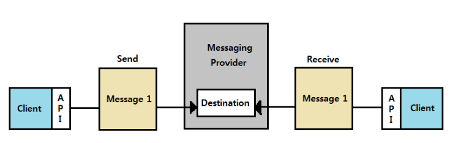

# 메시지 큐

# 메시지 큐란?

프로세스 또는 프로그램이 데이터를 서로 교환할 때 사용하는 통신 방법

메시지 지향 미들웨어(MOM; Message Oriented Middleware)를 구현한 시스템을 의미한다

## 메시지 지향 미들웨어란?

응용 소프트웨어 간의 데이터(비동기 메시지) 통신을 위한 소프트웨어

메시지 지향 미들웨어는 메시지를 전달하는 과정에서 메시지를 보관하거나 라우팅 및 변환 가능

- 보관
    - 메시지의 백업을 유지함으로써 지속성을 제공, 덕분에 송수신 측이 동시에 네트워크 연결을 유지할 필요가 없다
- 라우팅
    - 미들웨어 계층 자신이 직접 메시지 라우팅할 수 있기 때문에, 하나의 메시지를 여러 수신자에게 배포할 수 있다
- 변환
    - 송수신 측의 요구에 따라 메시지를 변환할 수 있다
    

하지만 다음과 같은 단점도 존재한다

- 아키텍처에 외부 구성 요소인 메시지 전송 에이전트가 필요
    - 일반적으로 새로운 요소를 추가할 경우 시스템 성능이 저하되고, 신뢰성이 떨어짐
- 시스템이 복잡해지기 때문에 관리가 어렵고 비용이 발생
- 어플리케이션 간의 통신은 기본적으로 동기이지만, 메시지 기반 통신은 비동기이기 때문에 메커니즘 불일치 발생
    - 이를 위해 요청을 그룹화하여 하나의 의사(pseudo)동기 트랜잭션으로 응답하는 기능을 가짐
- 표준이라고 부를 규격이 존재하지 않기 때문에 호환이 안될 수도 있음

## AMQP(Advanced Message Queuing Protocol)이란?

AMQP는 응용 계층의 MOM 표준으로, JMS(Java Message Service)와 비교되는데, JMS는 자바에서 지원하는 표준 API이다. JMS는 자바 어플리케이션 간 통신만 가능하고, 다른 MOM(AMQP, SMTP)와는 통신할 수 없다. 반면 AMQP는 프로토콜만 일치한다면 다른 AMQP를 사용한 어플리케이션과 통신할 수 있다.

## 메시지 큐의 장점

- 비동기(Asynchronous)
    - 데이터를 수신자에게 바로 보내지 않고 메시지 큐에 넣고 관리하기 때문에 비동기 처리 가능
- 비동조(Decoupling)
    - 어플리케이션과 분리할 수 있기 때문에 확장이 용이해짐
- 탄력성(Resilience)
    - 일부가 실패하더라도 전체에 영향을 주지 않음
- 과잉(Redundancy)
    - 실패할 경우 재실행 가능
- 보증(Guarantee)
    - 작업이 처리된 걸 확인할 수 있음
- 확장성(Scalable)
    - N:1:M의 구조로 다수의 프로세스들이 큐에 메시지를 보낼 수 있음

## 메시지 큐를 사용하는 경우는?

다양한 곳에 사용 가능

- 다른 곳의 API로부터 데이터 송수신 가능
- 다양한 어플리케이션에서 비동기 통신할 수 있게 됨
- 이메일 발송 및 문서 업로드
- 많은 양의 프로세스 처리 가능

<aside>
💡 메시지 큐는 소비자가 실제로 메시지를 어느 시점에 가져가서 처리할지는 보장하지 않는다. 언젠가는 큐에 넣어둔 메시지가 소비되어 처리될 것이라고 볼 뿐이다. 이러한 비동기적 특성 때문에 실패하면 치명적인 핵심 작업보다는 부가적인 기능에 사용하는 것이 좋다

</aside>

## 메시지 큐 사용 예시: 이메일 전송

어떤 웹 사이트의 비밀번호를 잃어버려 이메일을 통해 임시 비밀번호를 받거나, 새로운 회원가입을 위한 인증 코드를 받아본 경험이 있을 것이다. 이러한 상황에서 이메일이 즉각적으로 수신되기를 기대하지는 않을 것이다. 어느 정도의 응답 지연이 허용되며, 어플리케이션의 핵심 기능이 아닌 경우이므로 메시지 큐를 사용할 수 있다.

- 비밀번호 재설정을 위해 이메일을 발급하는 서비스, 회원가입을 위해 이메일을 발급하는 서비스 등은 메시지(이메일)를 큐에 넣는다
- 이메일 전송 전용 서비스는 이메일이 어느 서비스로부터 생산되었는지와는 관계 없이, 메시지 큐의 메시지를 하나씩 소비하고, 이메일이 전송되어야 할 곳으로 이메일을 전송한다
- 이와 같은 접근 방식은 메시지 큐에 들어오는 메시지 수가 너무 많아지는 경우 이메일 전송 전용 서비스 인스턴스를 더 둠으로써 확장할 수 있으므로 확장성이 뛰어나다

## 메시지 큐 사용 예시: 블로그 포스팅

모든 사용자가 웹에 최적화된 환경이거나, 용량이 작은 이미지만 업로드하진 않는다. 블로그 사용자가 게시글에 업로드한 이미지의 용량이 매우 큰 경우를 생각해보자. 블로그 서비스의 응답 시간을 저해하지 않으면서 사용자들에게 유연성을 제공하는 방법으로, 사용자가 업로드한 모든 이미지를 게시 과정에서 즉각적으로 처리하는 것이 아닌, 사후처리하여 최적화할 수 있다.

- 사용자가 고용량의 이미지가 포함된 블로그 포스팅을 한다
- 이미지는 저장소에 전송된다
- 업로드된 이미지에 대한 정보가 포함된 메시지를 이미지 최적화 서비스의 메시지 큐에 담는다
- 이미지 최적화 서비스는 저장소에서 이미지를 가져와 최적화하고, 앞서 저장해둔 이미지를 대체한다

## 메시지 큐의 종류

### RabbitMQ

- AMQP를 구현한 오픈소스 메시지 큐
- 신뢰성, 안정성과 성능을 충족할 수 있도록 다양한 기능을 제공
- 유연한 라우팅
    - 메시지 큐가 도착하기 전에 라우팅되며 플러그인을 통해 더 복잡한 라우팅도 가능
- 클러스터링
    - 로컬 네트워크에 있는 여러 RabbitMQ 서버를 논리적으로 클러스터링할 수 있고 논리적인 브로커도 가능
- 관리 UI가 있어 편하게 관리 가능
- 다양한 언어와 운영체제 지원

### Kafka

- 대용량의 실시간 로그 처리에 특화되어 설계된 메시징 시스템
- AMQP 프로토콜이나 JMS API를 사용하지 않고 단순한 메시지 헤더를 지닌 TCP 프로토콜을 사용하여 프로토콜에 의한 오버헤드를 감소시킴
- 생산자가 브로커에게 다수의 메시지를 전송할 때 각 메시지를 개별적으로 전송해야 하는 기본 메시징 시스템과 달리, 다수의 메시지를 배치 형태로 브로커에게 한 번에 전달 할 수 있어 TCP/IP 라운드 트립 횟수를 줄임
- 메시지를 파일 시스템에 저장하기 때문에 데이터의 영속성 보장
- 기존의 메시지 시스템은 메시지 큐에 적재된 메시지 양이 많을수록 성능이 크게 감소하지만, 카프카는 메시지를 바로 삭제하지 않고 파일 시스템에서 수명이 지나면 삭제하도록 처리
- 기존의 메시지 시스템은 브로커가 소비자에게 메시지를 푸쉬해주는 방식인 반면, 카프카는 소비자가 브로커로부터 직접 메시지를 가지고 가는 풀 방식으로 동작

⇒ 기존 메시지 큐의 다양한 기능을 포기하고 대용량 메시지를 처리하기 위한 기능을 제공하는 메시지 큐