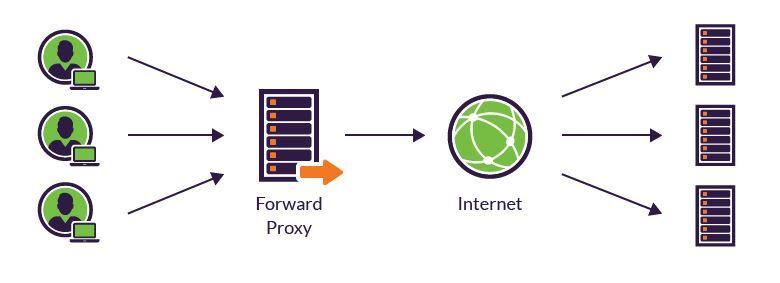

# 프록시

### 프록시란?

프록시란 두 호스트가 통신할 때 직접 통신하지 않고 중간에서 대리로 통신하도록 도와주는 것을 말한다. 이러한 중계 역할을 하는 서버를 프록시 서버라고 부른다.

프록시 서버가 중간에 위치함으로써 클라이언트는 프록시 서버를 서버라고 인식하고, 서버 입장에서는 프록시 서버를 클라이언트로 인식하게 된다.

프록시 서버는 서버가 어디에 위치하는지에 따라 포워드 프록시와 리버스 프록시로 나뉜다.

### 포워드 프록시

일반적으로 프록시라고 하면 포워드 프록시를 말한다. 클라이언트에서 서버로 리소스를 요청할 때 직접 요청하지 않고 프록시 서버를 거쳐서 요청한다. 이 경우 서버에서 받는 IP는 클라이언트의 IP가 아닌 프록시 서버의 IP이기 때문에 서버는 클라이언트가 누군지 알 수 없다. 즉, 서버에게 클라이언트가 누구인지 감춰주는 역할을 한다.

### 리버스 프록시

리버스 프록시는 포워드 프록시의 반대 개념으로, 클라이언트는 서버에 직접 호출하는 것이 아니라 프록시 서버를 통해 호출하게 되므로 클라이언트로부터 서버를 감추는 역할을 한다.

### 프록시 서버의 활용

1. 캐싱
2. 보안
3. 우회 접속
4. 특정 컨텐츠 제한
5. 로드밸런싱